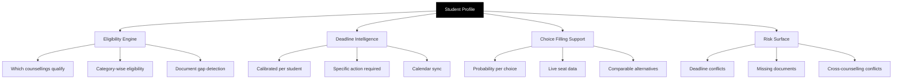

67% of students currently rely on paid consultants to navigate what is a free public process. The guidance layer exists to make that unnecessary.

PraveshAI™ guidance does not recommend decisions. It surfaces accurate, timely, specific information — so the student can decide with full knowledge of their situation.

---

## What the guidance engine covers

---

## Eligibility engine

The eligibility engine runs the moment a student's examination results are in.

<Steps>
  <Step title="Score ingestion">
    JEE Main, NEET UG, or state CET scores are fetched directly from the examination authority. The student does not enter scores manually.
  </Step>
  <Step title="Counselling matching">
    The engine checks the student's rank, category, and state of domicile against the eligibility criteria of every participating counselling. JoSAA, JAC Delhi, MHT CET, WBJEE, CUET UG, COMEDK — any applicable counselling appears in the student's view.
  </Step>
  <Step title="Document readiness check">
    For each eligible counselling, the engine checks whether the student's verified documents meet that counselling's requirements. Missing documents are flagged immediately — before registration closes, not after.
  </Step>
  <Step title="Eligibility confirmation">
    The student sees every counselling they qualify for, with deadlines, document status, and a clear indication of what action is needed and by when.
  </Step>
</Steps>

<Tip>
  Only 23% of students currently have the information they need at the point of choice filling. The eligibility engine is designed to move that number to 100%.
</Tip>

---

## Deadline intelligence

Generic deadline alerts do not work. Students stop reading them. Guidance that says "JoSAA choice fill is open" is background noise.

PraveshAI™ generates deadline alerts that are specific.

| What a generic alert says | What PraveshAI™ says |
| --- | --- |
| "JoSAA choice filling is open" | "Your JoSAA choice filling closes in 36 hours. You have 47 of 200 choices saved. Your OBC-NCL certificate is still pending — this is required before you can lock." |
| "Registration open" | "MHT CET registration closes on 4 May at 11:42 PM. You are eligible. One step remaining: confirm state of domicile." |
| "Spot round announced" | "JAC Delhi Spot Round opens Saturday at 10 AM. Your estimated queue position is #34 in OBC-NCL. All documents are ready. UPI is linked." |

Every alert is tied to a specific action, a specific student, and a specific deadline. Calendar sync is available — one tap sends the deadline to Google Calendar.

---

## Choice filling support

When a student fills their preference list before an allocation round, they are making one of the most consequential decisions of their admissions cycle. Most students currently do this with one source: last year's closing rank list.

PraveshAI™ adds three layers on top of that.

<CardGroup cols={3}>
  <Card title="Probability signal" icon="chart-bar">
    Safe, Good, or a percentage — computed from the student's rank, their category, and the current live seat matrix. Not last year's data. Right now.
  </Card>

  <Card title="Live seat data" icon="chair">
    How many seats are available in this category at this institute, updated continuously as other students confirm and withdraw.
  </Card>

  <Card title="Round trend insight" icon="clock-rotate-left">
    What actually happened in last year's equivalent round for this rank and category. Which branches filled in the first 18 candidates. Which had seats remaining at the end.
  </Card>
</CardGroup>

The guidance engine explains what each signal means. The student chooses.

---

## Risk surface

PraveshAI™ flags risks before they become problems.

<CardGroup cols={2}>
  <Card title="Deadline conflict" icon="triangle-exclamation">
    Two counsellings with overlapping critical windows. Student alerted to the overlap and given the sequence that resolves it.
  </Card>

  <Card title="Missing document" icon="file-circle-xmark">
    A counselling requires a document not yet in the vault. Flagged immediately, not at submission time.
  </Card>

  <Card title="Cross-counselling conflict" icon="arrows-rotate">
    A student who has accepted a seat in one counselling and is still participating in another. The system detects this and surfaces it before it creates an obligation conflict.
  </Card>

  <Card title="Eligibility gap" icon="circle-exclamation">
    A detail in the student's profile — state of domicile, category, score — that may affect eligibility in a specific counselling. Surfaced before registration closes.
  </Card>
</CardGroup>

---

## What PraveshAI™ does not do

<CardGroup cols={2}>
  <Card title="Does not recommend" icon="xmark">
    PraveshAI™ does not tell a student which college to choose. It surfaces data and probability. The decision is the student's.
  </Card>

  <Card title="Does not override" icon="xmark">
    No guidance output overrides a counselling authority's configured rules or a student's expressed decision.
  </Card>

  <Card title="Does not speculate" icon="xmark">
    Probability estimates are clearly labelled as estimates. Uncertainty is communicated, not hidden.
  </Card>

  <Card title="Does not replace human support" icon="xmark">
    For situations where the guidance engine cannot help, the student is directed to the appropriate support channel. PraveshAI™ knows its limits.
  </Card>
</CardGroup>

---

## Multilingual support

The guidance layer is designed to operate in multiple Indian languages — not as translated labels on top of an English interface, but as fully functional guidance outputs in the student's preferred language.

Hindi support is in active development. Regional language expansion is planned after the initial integration cycle.

---

<Info>
  Seat Allocation covers the allocation engine — how seats are matched to students, how the algorithm works, and how every outcome is made traceable.
</Info>