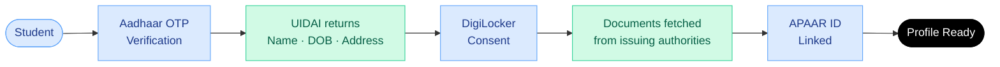

Every inefficiency in India's admissions process traces back to the same gap: no shared student identity across counselling systems. Every portal treats every student as a new, unverified person.

## Profile Creation Flow

> The student enters their Aadhaar number. Available documents are fetched automatically; unavailable fields can be completed via manual upload.

---

## What the profile contains

<CardGroup cols={2}>
  <Card title="Identity" icon="id-card">
    Name, date of birth, gender, address  pulled from UIDAI. The student types none of this.
  </Card>

  <Card title="Academic records" icon="graduation-cap">
    Class 10 and 12 marksheets fetched from issuing boards via DigiLocker.
  </Card>

  <Card title="Examination scores" icon="chart-line">
    Entrance exam scores fetched from examination authority APIs. Verified at source.
  </Card>

  <Card title="Category documents" icon="align-horizontal-distribute-start">
    Caste, income, and domicile certificates fetched from state government via DigiLocker where available.
  </Card>
</CardGroup>

---

## One profile, every counselling

Once verified, the same profile is read by every counselling the student registers for.

<Steps>
  <Step title="Verify your Aadhaar">
    The student enters their Aadhaar number. Encrypted verification via UIDAI. Nothing else is typed manually.

    <Frame>
      
    </Frame>
  </Step>
  <Step title="Confirm mobile access">
    OTP sent to the Aadhaar-linked mobile number. Valid for 3 minutes.

    <Frame>
      
    </Frame>
  </Step>
  <Step title="Fetch verified records">
    DigiLocker retrieves Aadhaar Identity, APAAR ID, Class 10 and 12 marksheets, and entrance scores from issuing authorities. Category certificate flagged for manual review where auto-fetch is unavailable.

    <Frame>
      
    </Frame>
  </Step>
  <Step title="Your Access ID is ready">
    A verified student profile is created and linked to a unique Access ID. Use it across every participating counselling — no re-verification required.

    <Frame>
      
    </Frame>
  </Step>
  <Step title="Create your security PIN">
    MPIN is set once and used for all approvals and sensitive actions across the platform.

    <Frame>
      
    </Frame>
  </Step>
</Steps>

The counselling authority does not re-run identity verification for students with a verified profile.

---

## Registration time

|  | Current system (per counselling) | Superadmission |
| --- | --- | --- |
| Identity entry | Manual form : 30-45 mins | Aadhaar OTP : 2-3 mins |
| Document upload | Manual PDF per portal : 20-30 min | DigiLocker fetch : automatic |
| Repeat for next counselling | Full process again | Reusable Identity and verified records |
| **Total across 4 counsellings** | **~180 - 240 mins (Form \+ Docs)** | **~10 - 15 mins** |

---

## What the student controls

<Steps>
  <Step title="Consent">
    DigiLocker document fetch requires explicit student consent. Granted once, per session, reviewable at any time.
  </Step>
  <Step title="Visibility">
    The student can see every field the platform holds and the verification status per document.
  </Step>
  <Step title="Privacy">
    Profile is private by default. The student can export their data or delete the DigiLocker sync at any time.
  </Step>
  <Step title="Deletion">
    The student can delete their account and revoke all connected identity sync.
  </Step>
</Steps>

---

<Info>
  Document Workflows covers what happens after the profile is created — how documents are fetched, verified, and reused.
</Info>