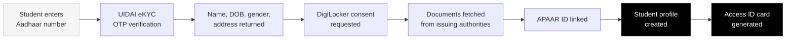
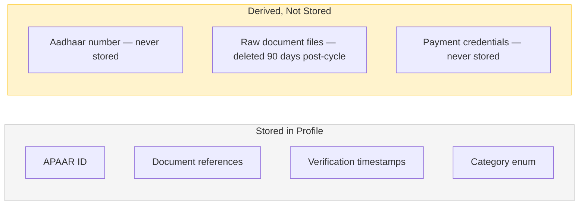
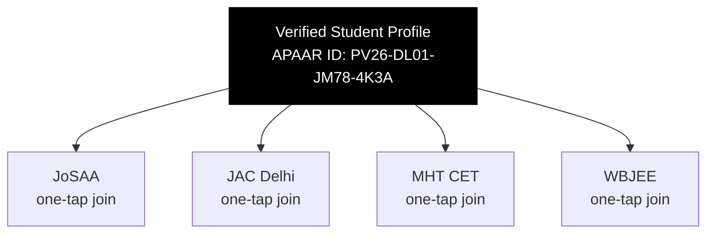

Every inefficiency in the current admissions process traces back to the same root: there is no shared student identity across counselling systems. Every portal treats every student as a new, unverified person.

The identity layer is the fix. A student verifies once. Every participating counselling reads from that record.

---

## How verification works

The student types their Aadhaar number. Everything after that is fetched — not entered.

---

## What the profile contains

<CardGroup cols={2}>
  <Card title="Identity fields" icon="id-card">
    Name, date of birth, gender, address — pulled from UIDAI directly. Student types none of this.
  </Card>
  <Card title="Academic records" icon="graduation-cap">
    Class 10 and 12 marksheets from CBSE or state boards, fetched via DigiLocker from the issuing authority.
  </Card>
  <Card title="Examination scores" icon="chart-line">
    JEE Main, NEET, state CET scores fetched via NTA or state board APIs. Verified at source.
  </Card>
  <Card title="Category documents" icon="file-certificate">
    Caste certificate, income certificate, domicile certificate — fetched from state government via DigiLocker where available.
  </Card>
</CardGroup>

---

## Verification states

Every field in the student profile carries a verification state.

| State | Meaning | What happens next |
|---|---|---|
| `Verified` | Confirmed by issuing authority | Accepted by all integrated counsellings |
| `Manual Review` | Student uploaded; auto-verification not possible | PraveshAI™ scores confidence; goes to reviewer queue |
| `Pending` | Fetch in progress | Student notified when complete |
| `Expired` | Document past validity period | Student prompted to refresh |
| `Missing` | Required for a specific counselling | Student alerted before deadline |

---

## Data held vs data derived

<Warning>
The Aadhaar number is never stored in Superadmission's systems at any point. Only the APAAR ID — a non-reversible derivative — is retained. This is an architecture decision, not a policy statement.
</Warning>

---

## What the student controls

<Steps>
  <Step title="Consent">
    DigiLocker document fetch requires explicit student consent. This is granted once, per session, and can be reviewed.
  </Step>
  <Step title="Visibility">
    The student can see every piece of information the platform holds about them, including verification status per document.
  </Step>
  <Step title="Privacy settings">
    Profile visibility is private by default. Consent controls are enabled. The student can export their data or delete the DigiLocker sync at any time.
  </Step>
  <Step title="Deletion">
    The student can delete their account and revoke all connected identity sync. Nothing is held without the ability to remove it.
  </Step>
</Steps>

---

## Cross-counselling access

Once a verified profile exists, participating counselling authorities read from it directly.

The counselling authority does not re-run identity verification for students with a verified Superadmission profile. The verification happened once. The result is the input.

---

## Registration time comparison

| Step | Current system (per counselling) | Superadmission |
|---|---|---|
| Identity entry | Manual form — 10-15 min | Aadhaar OTP — 2 min |
| Document upload | Manual PDF per portal — 20-30 min | DigiLocker fetch — automatic |
| Repeat for next counselling | Full process again | One tap |
| Total across 4 counsellings | ~170 min | ~14 min |

---

<Info>
Document Workflows covers what happens after the profile is created — how documents are verified, scored, and reused across counsellings.
</Info>