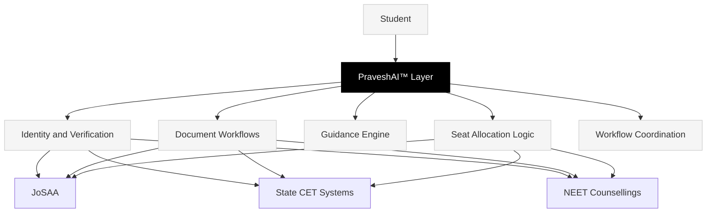

PraveshAI™ is not a chatbot. It is the reasoning and orchestration engine that runs underneath every student-facing workflow in Superadmission.

It is designed to do what no static portal can — reason about a student's specific situation, surface the right information at the right moment, and coordinate across multiple counselling systems simultaneously.

---

---

## What PraveshAI™ handles

<CardGroup cols={3}>
  <Card title="Identity" icon="fingerprint">
    One-time Aadhaar-linked verification. Student profile created once, read by every participating counselling.
  </Card>

  <Card title="Documents" icon="file-shield">
    Verified at source. Reused across counsellings. No re-upload. Confidence scoring before human review.
  </Card>

  <Card title="Guidance" icon="compass">
    Eligibility checks, deadline alerts, choice-filling probability — all calibrated to the student's specific situation.
  </Card>

  <Card title="Allocation" icon="scale-balanced">
    Gale-Shapley stable matching. Configurable per authority. Fully auditable. Every outcome traceable.
  </Card>

  <Card title="Coordination" icon="arrows-split-up-and-left">
    State machine across multiple counselling workflows. Deadline sync. Cross-system status tracking.
  </Card>

  <Card title="Auditability" icon="magnifying-glass-chart">
    Every decision logged. Every action hash-stamped. Student-readable. Authority-verifiable.
  </Card>
</CardGroup>

---

## What PraveshAI™ is not

<CardGroup cols={2}>
  <Card title="Not a decision-maker" icon="battery-warning">
    PraveshAI™ informs and surfaces. The student decides. The counselling authority governs. PraveshAI™ never overrides either.
  </Card>

  <Card title="Not a black box" icon="xmark">
    Every recommendation, every probability estimate, every allocation output has a traceable basis. Nothing is opaque.
  </Card>
</CardGroup>

---

## System layers

| Layer | Function | Status |
| --- | --- | --- |
| Identity and Verification | Aadhaar-aligned profile creation, document source verification | Prototype built |
| Document Workflows | Upload, verify, reuse architecture | Prototype built |
| Guidance Engine | Eligibility, deadlines, choice-filling support | Prototype built |
| Seat Allocation | Matching algorithm, round logic, audit trail | Validated against JoSAA 2023-24 |
| Workflow Coordination | Cross-counselling state management | Architecture designed |
| Audit and Explainability | Decision logging, student-readable outputs | Prototype built |

<Info>
  Each layer is documented in the pages that follow. Start with Identity and Verification — it is the foundation every other layer depends on.
</Info>