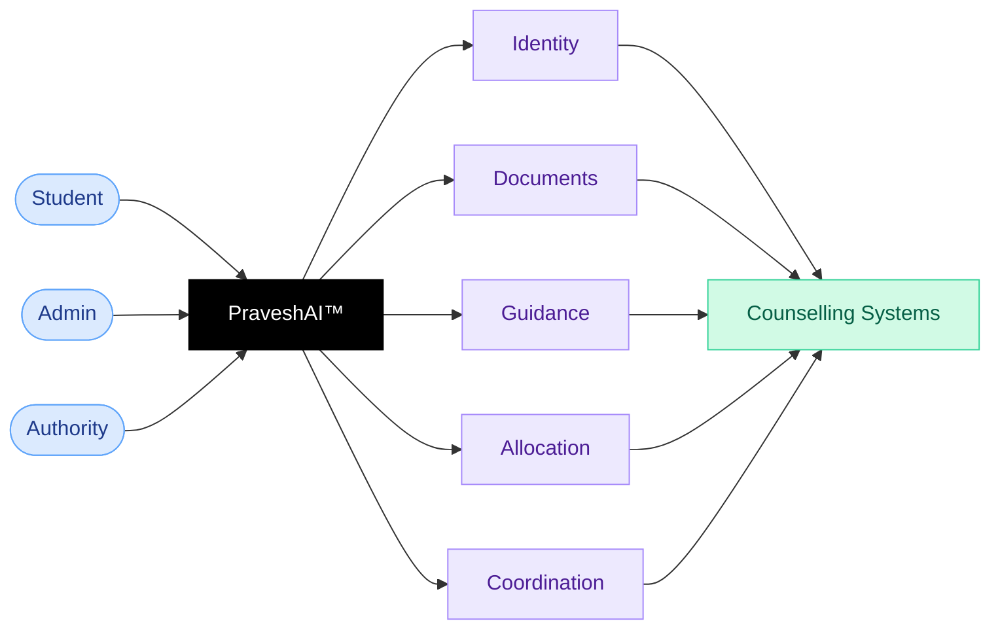

> **PraveshAI is the intelligence layer powering Superadmission across all workflows, supporting students, reviewers, and authorities. It tracks system state in real time, surfaces required actions, and provides structured guidance at every step. Every decision it influences is recorded, fully traceable, and auditable.**

---

## Architecture

---

## PraveshAI functions across the system

<CardGroup cols={3}>
  <Card title="Profile" icon="fingerprint">
    A single student profile is created using available data. Information is auto-fetched where possible and completed manually where required.
  </Card>

  <Card title="Documents" icon="file-shield">
    Documents are processed on upload and assigned a verification signal. Review-required cases are routed with identified issues and tracked to resolution.
  </Card>

  <Card title="Guidance" icon="compass">
    Provides eligibility checks, choice-filling support, and decision context based on student profile, rank, preferences, and process-specific rules.
  </Card>

  <Card title="Allocation" icon="scale-balanced">
    Executes merit and preference-based allocation as defined by the authority. All outcomes are deterministic, traceable, and auditable.
  </Card>

  <Card title="Coordination" icon="arrows-split-up-and-left">
    Maintains state across active processes, including deadlines, application stages, payments, and required actions, with alerts based on current state.
  </Card>

  <Card title="Audit" icon="magnifying-glass-chart">
    Records all actions and decisions using append-only logs. Each outcome is linked to a complete, verifiable audit trail.
  </Card>
</CardGroup>

---

## System layers

| Layer | What it does |
| --- | --- |
| Identity and Profile | Supports profile creation using available data and maintains identity-linked records |
| Document Workflows | Handles document upload, assigns verification signals, routes review, and enables reuse across processes |
| Guidance Engine | Performs eligibility checks, supports choice filling, and provides decision context per student |
| Seat Allocation | Executes allocation based on merit, preferences, round structure, and authority-defined rules |
| Workflow Coordination | Tracks application state across processes, including deadlines, stages, payments, and required actions |
| Audit and Explainability | Records all actions and decisions with complete, traceable, and verifiable audit logs |

<Frame caption="PraveshAI™ knows your rank, documents, deadlines, and choices. Contextual prompts surface the most relevant questions for your current counselling stage.">
  
  
</Frame>

---