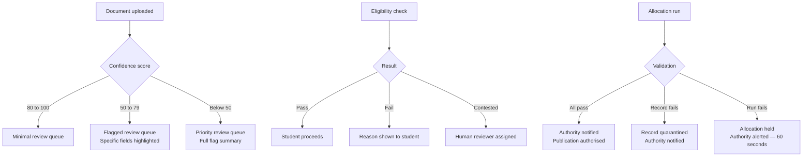
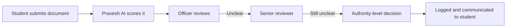

Every automated system needs defined boundaries. Superadmission's safeguards are not afterthoughts — they are part of the architecture. Certain decisions require human authorisation. Certain states trigger mandatory review. Certain actions are explicitly outside what the system can do independently.

---

## What Pravesh AI cannot decide alone

<CardGroup cols={2}>
  <Card title="Allocation outcomes" icon="gavel">
    The engine produces a match. A counselling authority reviews and triggers publication. The system does not publish without authorisation.
  </Card>
  <Card title="Document rejection" icon="file-xmark">
    A low confidence score flags a document. A human officer makes the final call — approve, reject, or request resubmission.
  </Card>
  <Card title="Eligibility disputes" icon="scale-balanced">
    Where a student contests an eligibility determination, the case goes to a human reviewer. Pravesh AI does not adjudicate disputes.
  </Card>
  <Card title="Override actions" icon="hand">
    Any action that reverses a system state — reopening a closed round, reinstating a lapsed seat — requires explicit authority-level authorisation.
  </Card>
</CardGroup>

---

## Manual review triggers

These conditions automatically route a case to human review:

---

## The verification officer's role

Officers do not receive raw document queues. They receive annotated queues.

| What arrives | What the officer sees |
|---|---|
| Low confidence document | Exactly which fields Pravesh AI flagged and why |
| Moderate confidence document | Specific inconsistencies highlighted |
| High confidence document | Summary confirmation, minimal review needed |

The officer's actions — approve, reject, request resubmission — are all logged. Every decision has a timestamped record tied to the officer's account.

<Tip>
**The confidence score organises human attention.** It does not replace it. Officers spend time on the cases that need it, not on uniform blind review of everything.
</Tip>

---

## Escalation paths

No case ends without a decision. No decision is made without a record.

---

## System-level controls

Certain platform-wide controls exist only at the authority level:

- **Round pause** — authority can pause an active round
- **Deadline extension** — authority can extend a deadline with reason logged
- **Seat matrix update** — authority can amend before a round opens, not after allocation runs
- **Allocation trigger** — authority initiates, system runs, authority reviews before publication

<Warning>
None of these controls are available to students or institutions. Every use is logged in the audit trail with the authorising account, timestamp, and stated reason.
</Warning>

---

## What the system will not do

- Publish an allocation without authority sign-off
- Reject a document without a human decision
- Adjudicate an eligibility dispute automatically
- Take any irreversible action — seat acceptance, admission confirmation, QR expiry — without clear student consent recorded first

---

<Info>
How every decision, action, and state change is recorded and queryable is in Audit and Explainability.
</Info>