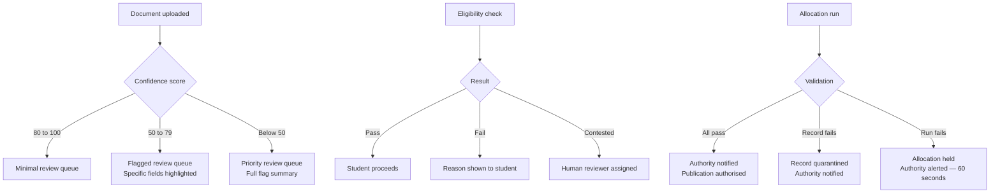
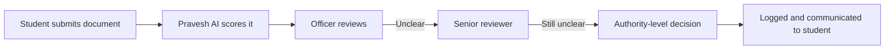

In Superadmission architecture automated systems operate within defined boundaries. Safeguards are built into the system design. Certain decisions require human authorisation, some states trigger mandatory review, and specific actions are not executed without human involvement.

---

## What Pravesh AI cannot decide alone

<CardGroup cols={2}>
  <Card title="Allocation outcomes" icon="gavel">
    The engine produces a match. A counselling authority reviews and triggers publication. The system does not publish without authorisation.
  </Card>

  <Card title="Document rejection" icon="file-xmark">
    Documents that require review are evaluated by a human officer, who decides to approve, reject, or request resubmission.
  </Card>

  <Card title="Eligibility disputes" icon="scale-balanced">
    Eligibility disputes are reviewed by a human. The system does not make final decisions in such cases.
  </Card>

  <Card title="Override actions" icon="hand">
    Actions that change an existing system state, such as reopening a closed round  require explicit authorisation.
  </Card>
</CardGroup>

<Frame caption="Account settings — the student controls their profile, identity sync, and can delete their account or revoke DigiLocker access at any time">
  
</Frame>

---

## Manual review triggers

These conditions automatically route a case to human review:

---

## The verification officer's role

Officers do not receive raw document queues. They receive annotated queues.

| What arrives | What the officer sees |
| --- | --- |
| Document flagged for review | Specific fields flagged by PraveshAI with reasons |
| Document with partial verification signal | Highlighted inconsistencies |
| Document with strong verification signal | Summary confirmation with minimal review required |

The officer's actions are all logged. Every decision has a timestamped record tied to the officer's account.

<Tip>
  **The verification signal organises human attention.** Officers spend time on the cases that need it, not on uniform blind review of everything.
</Tip>

---

## Escalation paths

No case ends without a decision. No decision is made without a record.

---

## System-level controls

Certain platform-wide controls exist only at the authority level:

- **Round pause** : authority can pause an active round
- **Deadline extension** : authority can extend a deadline with reason logged
- **Seat matrix update** : authority can amend before a round opens, not after allocation runs
- **Allocation trigger** : authority initiates, system runs, authority reviews before publication

<Warning>
  None of these controls are available to students or institutions. Every use is logged in the audit trail with the authorising account, timestamp, and stated reason.
</Warning>

<Frame caption="Security settings — MPIN, 2FA, passkey, login alerts, and trusted device controls">
  
</Frame>

---

<Info>
  How every decision, action, and state change is recorded and queryable is in Audit and Explainability.
</Info>