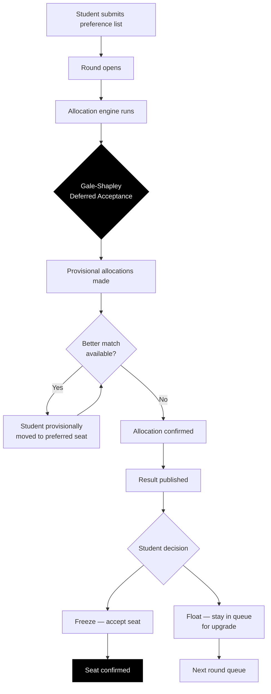
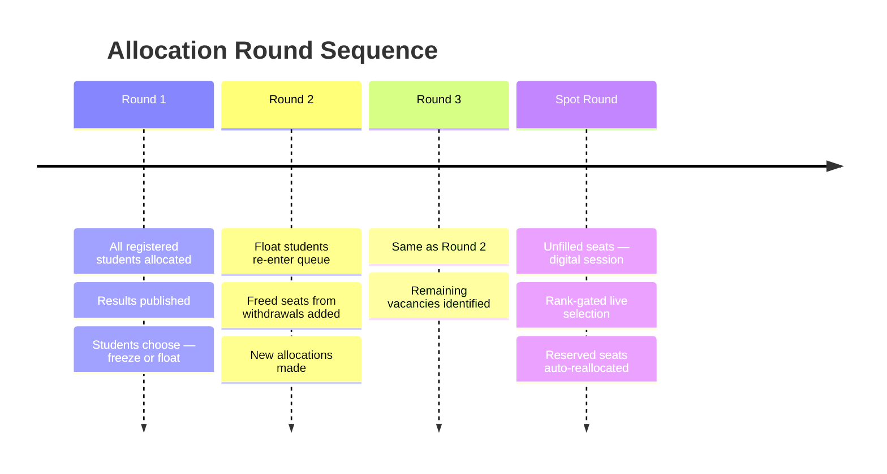
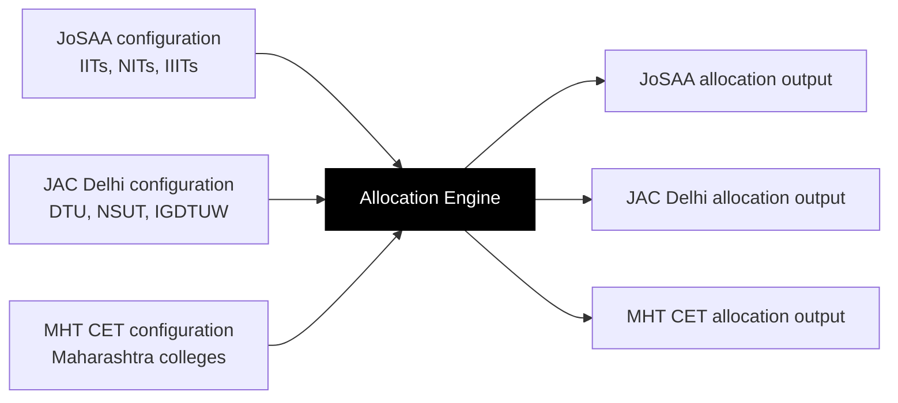

Seat allocation is the most consequential output of the admissions process. For each student, it determines where they study for the next four years. For counselling authorities, it determines how fairly and efficiently their seat matrix is used.

The allocation engine in PraveshAI™ is designed around one requirement: every outcome must be explainable, traceable, and fair by construction.

---

## The algorithm



**The algorithm:** Gale-Shapley deferred acceptance, the mathematical framework behind the 2012 Nobel Prize in Economics. Used in the US National Resident Matching Program to place 40,000\+ medical graduates annually.

**The key property:** Listing genuine preferences in genuine order is always the optimal strategy. Mathematically guaranteed. No gaming. No coaching advantage. The student who was told "don't put your real first choice first" now has no reason to follow that advice.

---

## Category and quota handling

Indian admissions operate under a complex reservation framework. The allocation engine handles this natively.

<CardGroup cols={2}>
  <Card title="Category types" icon="people-group">
    General (UR), OBC-NCL, SC, ST, EWS, PwD — each with separate seat pools and ranking within category
  </Card>

  <Card title="Sub-categories" icon="layer-group">
    PwD within category, defence quota, home state quota, supernumerary seats — all configurable per counselling authority
  </Card>

  <Card title="Horizontal reservations" icon="arrows-left-right">
    PwD seats that cut across vertical categories, handled correctly within the algorithm
  </Card>

  <Card title="Sliding logic" icon="chevrons-down">
    If a general category seat is filled before a reserved seat can be claimed, the engine identifies this and adjusts correctly
  </Card>
</CardGroup>

<Tip>
  In the current system, 23% of institutions consistently struggle to fill reserved category seats — not because eligible students don't exist, but because the coordination mechanism fails to connect them. The allocation engine includes automated reserved-seat reallocation: unfilled reserved seats are reprocessed within the same cycle before they lapse.
</Tip>

---

## Round structure



---

## The audit trail

Every allocation decision generates a complete log. Not a summary. The full trace.

| What is logged | Example |
| --- | --- |
| Student rank applied | OBC-NCL rank: 4,521 |
| Preferences considered | Choice #1: NIT Trichy CSE — not available. Choice #2: NIT Warangal CSE — available |
| Seat availability at allocation time | 3 seats remaining in OBC-NCL at NIT Warangal CSE |
| Rule applied | OBC-NCL category, Gender-Neutral pool, JEE Main score |
| Outcome | Seat allocated at choice #2 |
| Hash | 0x726441C |

If a student questions their result, the trail answers the question. If a counselling authority wants to verify the engine applied their configured rules correctly, the trace is there for every student.

This is the audit trail a student sees after allocation:

```text
Round 2 Seat Allotted
NIT Trichy CSE is now reserved
Counselling: JAC Delhi
Status: Important
Source: System
Hash: 0x726441C
```

---

## What the student sees

<Steps>
  <Step title="Choice filling">
    Student builds and ranks their preference list. Pravesh AI surfaces probability signals, live seat data, and round trend insights. Student locks choices before the deadline.
  </Step>
  <Step title="Allocation result">
    Seat Confirmed screen — college, programme, category, access ID. Not a text table. A clear confirmation with immediate next steps.
  </Step>
  <Step title="Decision">
    Freeze or Float. The platform explains what each option means before the student chooses. The MPIN is required for any seat action — an extra layer before an irreversible step.
  </Step>
  <Step title="Audit access">
    The student can access the full decision trail for their allocation. Every step. Every rule. Every hash.
  </Step>
</Steps>

---

## Configurable per authority

The allocation engine is not a one-size-fits-all system. Each counselling authority configures their own seat matrix, reservation rules, round structure, and tiebreaker logic.



The engine runs what the authority configures. The authority governs. The engine executes.

---

## Edge cases the engine handles

<Accordion title="What happens if no seat is available for a student?">
  The student receives a clear no-allocation result with the reason: no seat was available at or above their rank in any of their listed preferences within their category. The audit trail shows every preference considered and why each was unavailable. The student remains eligible for subsequent rounds.
</Accordion>

<Accordion title="What happens in a tie at the last available seat?">
  Tiebreaker rules are configured by the counselling authority and applied in the order they specify — typically by age, then by a secondary score criterion. The tiebreaker logic is documented in the audit trail for the affected student.
</Accordion>

<Accordion title="What happens if a reserved seat goes unclaimed?">
  The engine's automatic reserved-seat reallocation processes the seat within the same cycle. Before the round closes, unclaimed reserved seats are re-run against eligible candidates who were not allocated in earlier steps. The seat does not lapse while eligible students remain in the queue.
</Accordion>

<Accordion title="What happens if a student withdraws after confirmation?">
  The confirmed seat is released back into the pool for subsequent rounds. The student's withdrawal is logged with a timestamp and hash. The released seat becomes visible in the live vacancy layer immediately.
</Accordion>

---

<Info>
  Workflow Coordination covers how PraveshAI™ manages state across multiple counselling systems — deadline sync, status tracking, and the cross-counselling conflict detection that prevents seat blocking.
</Info>