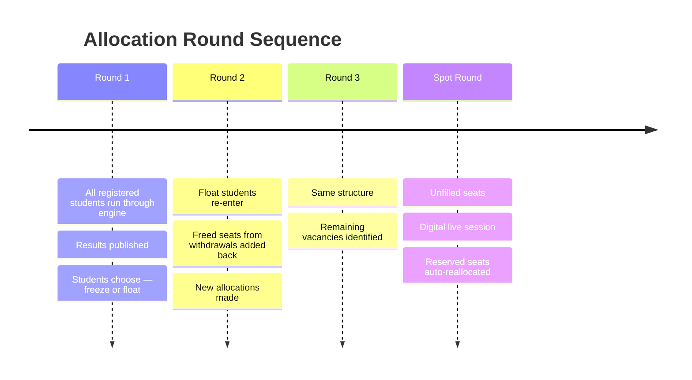
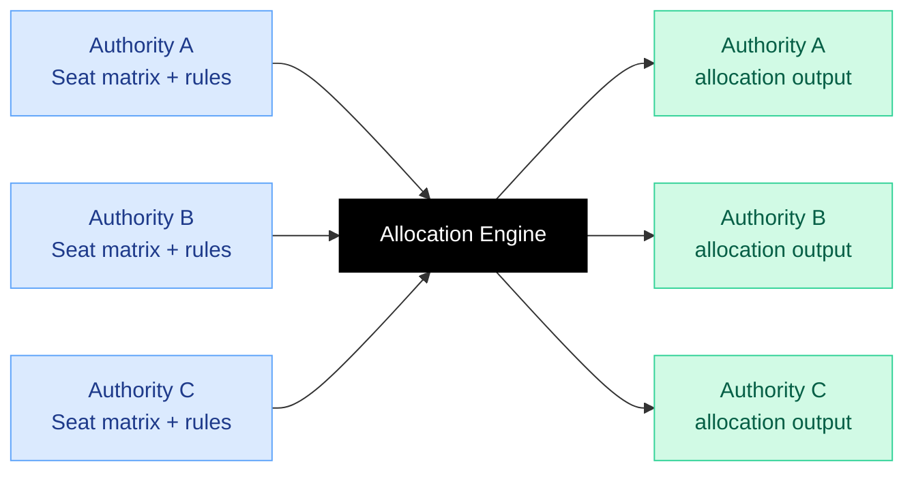

Seat allocation is the most consequential output of the admissions process. The allocation engine in PraveshAI™ is built around one requirement: every outcome must be fair by construction, and every outcome must be explainable.

---

## How the engine works

**The core property of this matching design:** listing genuine preferences in genuine order is always the optimal strategy. No gaming. No coaching advantage. The student who lists what they actually want always does at least as well as any alternative approach.

---

## Category and quota handling

<CardGroup cols={2}>
  <Card title="Vertical categories" icon="people-group">
    General (UR), OBC-NCL, SC, ST, EWS — each with separate seat pools and category-wise ranking
  </Card>
  <Card title="Sub-categories" icon="layer-group">
    PwD within category, defence quota, home state quota, supernumerary seats — all configurable per authority
  </Card>
  <Card title="Horizontal reservations" icon="arrows-left-right">
    PwD seats that cut across vertical categories — handled correctly within the algorithm
  </Card>
  <Card title="Reserved seat reallocation" icon="arrows-rotate">
    Unfilled reserved seats are reprocessed within the same cycle before they lapse. Not carried forward. Not lost.
  </Card>
</CardGroup>

<Tip>
23% of institutions consistently struggle to fill reserved category seats — not because eligible students don't exist, but because the coordination mechanism fails to connect them in time. Automated reallocation within the cycle is designed to address this structurally.
</Tip>

---

## Round structure

---

## What the student sees

<Steps>
  <Step title="Choice filling">
    Student builds and ranks preference list. PraveshAI™ surfaces probability signals, live seat availability, and round trend insights. Student locks choices before the deadline.
  </Step>
  <Step title="Result">
    Seat Confirmed screen — college, programme, category, Access ID. Clear confirmation with immediate next steps listed.
  </Step>
  <Step title="Decision">
    Freeze or Float. The platform explains what each option means before the student acts. MPIN is required for any seat action — a deliberate step before an irreversible one.
  </Step>
</Steps>

---

## Configurable per authority

Each counselling authority configures their own seat matrix, reservation rules, round structure, and tiebreaker logic. The engine runs what the authority configures. The authority governs. The engine executes.

---

## Edge cases

<Accordion title="No seat available for a student">
  The student receives a clear no-allocation result with the reason: no seat was available at or above their rank in any listed preference within their category. Every preference considered is visible in the decision trace. The student remains eligible for subsequent rounds.
</Accordion>

<Accordion title="Tie at the last available seat">
  Tiebreaker rules are configured by the counselling authority and applied in the specified order. The tiebreaker logic appears in the decision trace for the affected student.
</Accordion>

<Accordion title="Student withdraws after confirmation">
  The confirmed seat is released back into the pool immediately. The withdrawal is logged with timestamp and hash. The released seat becomes visible in the live vacancy layer.
</Accordion>

<Accordion title="Reserved seat goes unclaimed">
  The engine's automatic reallocation processes the seat within the same cycle against remaining eligible candidates. The seat does not lapse while eligible students are in the queue.
</Accordion>

---

<Info>
Audit and Explainability covers the full decision trace — what is logged per allocation, what the student can see, and what counselling authorities can verify.
</Info>