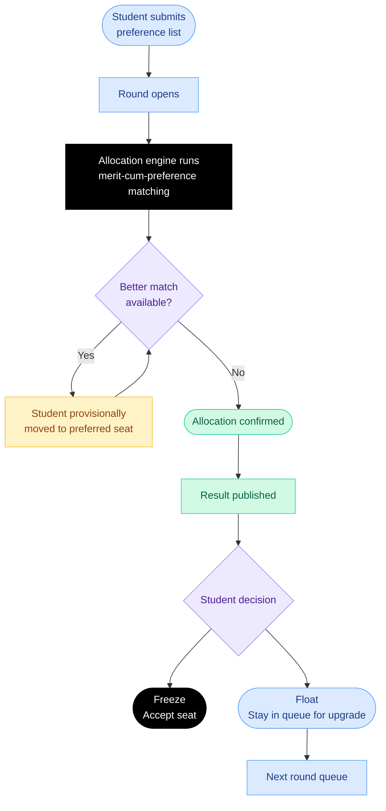
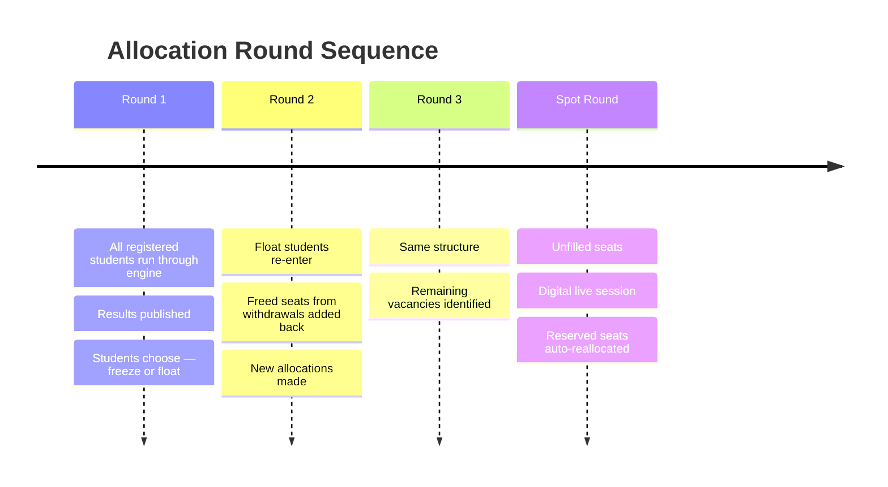
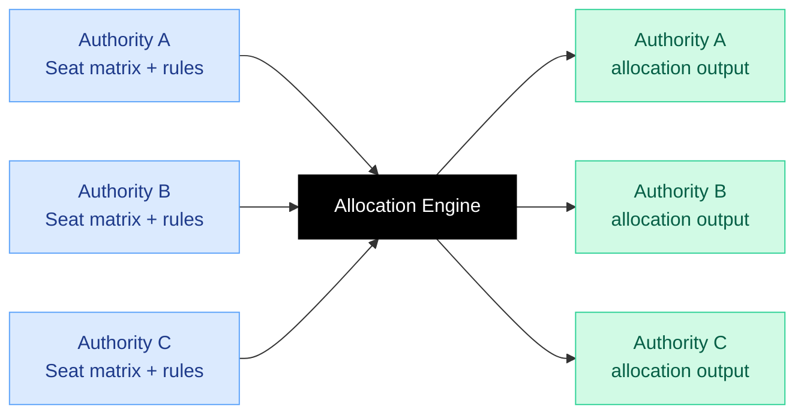

Seat allocation is a core outcome of the admissions process. The allocation module in PraveshAI™ is designed to ensure fairness and provide clear, verifiable explanations for each outcome.

---

## How the engine works

**The core property of this matching design:** listing genuine preferences in genuine order is always the optimal strategy.

---

## Category and quota handling

<CardGroup cols={2}>
  <Card title="Vertical categories" icon="people-group">
    General (UR), OBC-NCL, SC, ST, EWS — each with separate seat pools and category-wise ranking
  </Card>

  <Card title="Sub-categories" icon="layer-group">
    PwD within category, defence quota, home state quota, supernumerary seats — all configurable per authority
  </Card>

  <Card title="Horizontal reservations" icon="arrows-left-right">
    PwD seats that cut across vertical categories — handled correctly within the algorithm
  </Card>

  <Card title="Reserved seat reallocation" icon="arrows-rotate">
    Unfilled reserved seats are reprocessed within the same cycle before they lapse. Not carried forward. Not lost.
  </Card>
</CardGroup>

<Tip>
  23% of institutions consistently struggle to fill reserved category seats. Automated reallocation within the cycle is designed to address this structurally.
</Tip>

---

## Round structure

<Frame caption="Choice filling detail — institute list with previous year OBC closing rank and annual fee, priority order on the right, completion status and submission readiness at the bottom">
  
  
</Frame>

---

## What the student sees

<Steps>
  <Step title="Choice filling">
    Student builds and ranks preference list. PraveshAI™ surfaces probability signals, live seat availability, and round trend insights. Student locks choices before the deadline.
  </Step>
  <Step title="Result">
    Seat Confirmed. Clear confirmation with immediate next steps listed.
  </Step>
  <Step title="Decision">
    Freeze or Float. The platform explains what each option means before the student acts. MPIN is required for any seat action.
  </Step>
</Steps>

---

## Configurable per authority

> Each authority defines its seat matrix, reservation rules, round structure, and tie-breaker logic. The  seat allocation module executes these configurations.

---