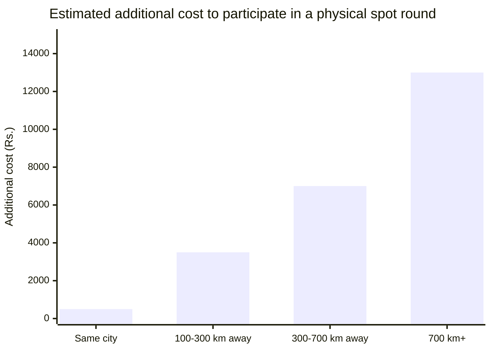
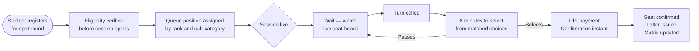
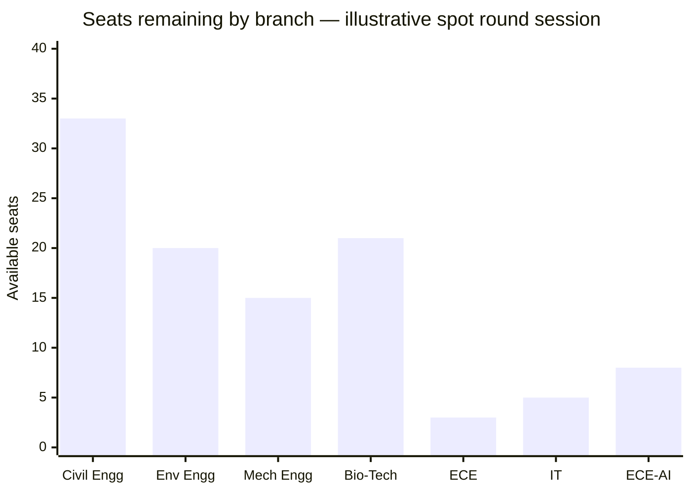

title: "Virtual Spot Round" description: "Spot rounds without the travel, the queues, or the demand drafts." icon: "person-chalkboard"

---

After all standard rounds close, seats remain. The spot round fills them. It has always been the most operationally painful part of the admissions cycle — for students and authorities alike.

The virtual spot round keeps what makes it fair. It removes everything else.

---

## What physical spot rounds involve today

<CardGroup cols={2}>
  <Card title="Physical presence required" icon="location-dot">
    Students must report to the designated campus in person, on a specific date, regardless of where they live
  </Card>

  <Card title="Demand drafts only" icon="file-invoice">
    Payment must be made via a pre-prepared demand draft from a specific bank branch. No other mode accepted.
  </Card>

  <Card title="No preparation time" icon="hourglass-end">
    When your number is called, you decide at a counter immediately. The queue behind you is not waiting.
  </Card>

  <Card title="No seat visibility before your turn" icon="eye-slash">
    Students have no view of what seats are available or disappearing until they are physically at the counter
  </Card>
</CardGroup>

---

## Who this hits hardest

_Travel and accommodation estimates for participating in a physical spot round held at a metro-city campus._

Students from smaller cities and towns pay significantly more — in money and time — for the same seat access as students already in the city. The spot round has always been geographically biased. That is the problem the virtual format solves first.

---

## How the virtual spot round works

---

## Before the session

Before the session opens, every student knows:

- Their exact position in the queue within their sub-category
- Their eligibility status — documents, category, payment — checked and confirmed in advance
- How long until the session starts
- What Pravesh AI estimates is realistically within reach at their position

No surprises when the session goes live.

---

## While waiting — the live seat board

While waiting for their turn, students watch the live seat board update in real time.

Every seat selection made by students ahead updates the board instantly. Students know exactly what is likely to still be there by their turn. The waiting period becomes productive preparation, not anxious guessing.

---

## The 8-minute selection window

When the student's turn comes, a selection screen opens. They have **8 minutes**.

**Why 8 minutes:**

Research on complex multi-option decisions shows the average time needed to compare structured choices is 4 to 7 minutes when information is well-presented. Eight minutes gives genuine decision time while keeping the session completable in a single day.

| Session size | Time per student | Total session length |
| --- | --- | --- |
| 200 students | 8 minutes | Under 5 hours |
| 500 students | 8 minutes | Under 11 hours |
| 1,000 students | 8 minutes | Under 22 hours |

The screen shows the student their **top 4 matched choices** first — the intersection of their original preference list and currently available seats. A scroll menu below shows every other available seat for students who want to look beyond their list.

Each option shows branch, institution, category, annual fee, and previous year closing rank for that sub-category. No information hunt. No external research needed during the window.

---

## Confirmation

Student selects. UPI payment completes. Seat confirmed.

The allotment letter is available immediately. Reporting date, document requirements, and fee deadline all shown on the same screen. The seat matrix updates for the next student before the current student closes the tab.

---

## Physical vs virtual

|  | Physical spot round | Virtual spot round |
| --- | --- | --- |
| Location | Designated campus — in person | Anywhere with internet |
| Payment | Demand draft, specific bank branch | UPI, confirmed in seconds |
| Decision time | Immediate, at a counter | 8 minutes, clean interface |
| Seat visibility | None before your turn | Live board throughout session |
| Preparation | Not possible while queueing | Full visibility from the moment session opens |
| Students outside city | Travel and accommodation required | No additional requirement |
| Confirmation | Manual | Digital allotment letter, instant |

<Tip>
  **The seat access is identical. The operational barrier is not.**
</Tip>

---

<Info>
  For the complete end-to-end journey across all phases, see The Admission Journey.
</Info>