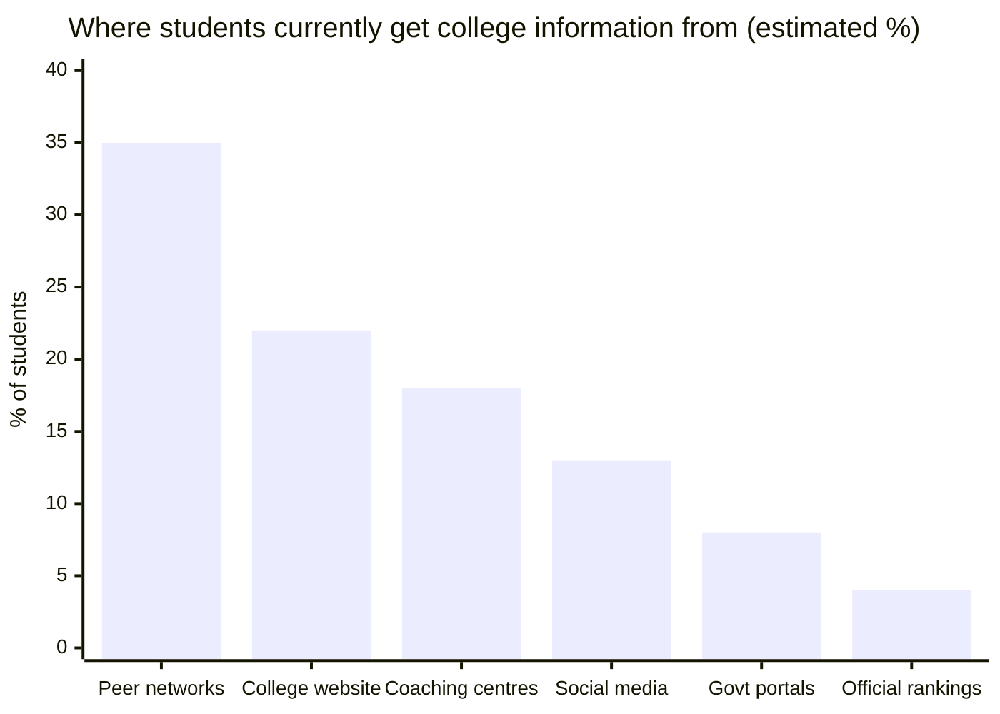
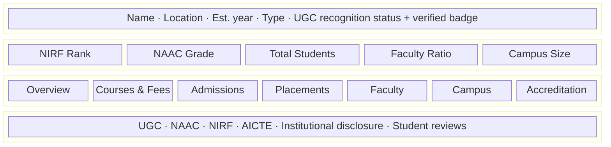
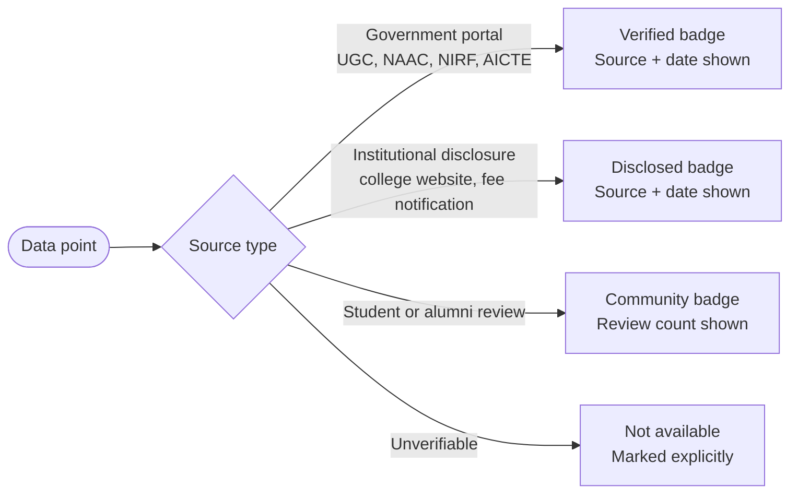
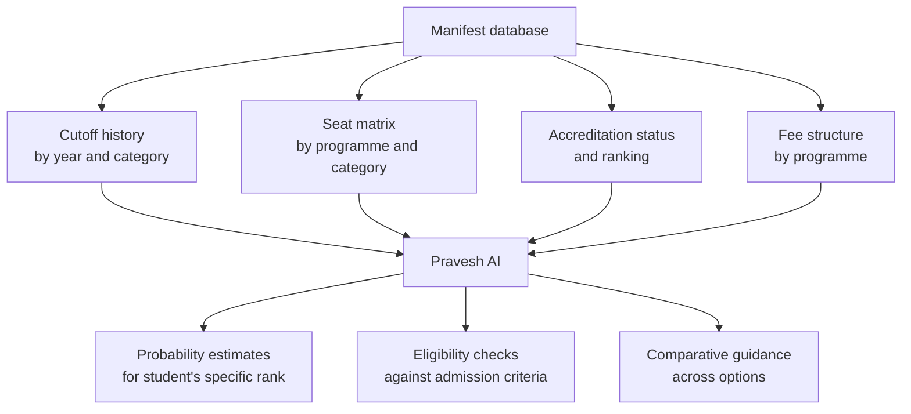
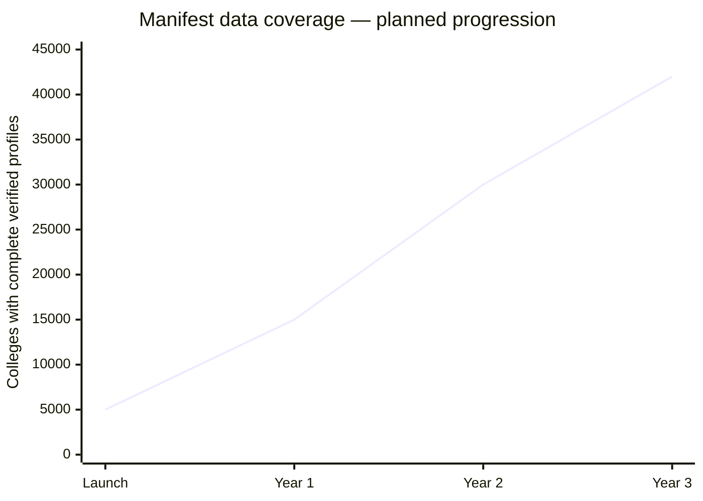
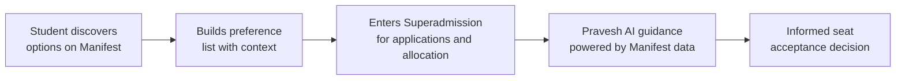

Before a student can make a good admissions decision, they need reliable information about their options. Right now, that information does not exist in one place.

College websites go months without updates. Placement data is marketing, not evidence. Fee structures change without notice. Accreditation statuses are buried in UGC PDFs. Students piece together a picture of a college from Instagram posts, JustDial reviews, and their cousin's opinion.

Manifest fixes the information layer. Before Superadmission handles the admission, Manifest handles the understanding.

---

## What Manifest is

<CardGroup cols={2}>
  <Card title="Verified college registry" icon="database">
    Every college in India with structured, source-verified data pulled from UGC, NAAC, NIRF, AICTE, and institutional disclosures
  </Card>

  <Card title="Searchable discovery layer" icon="magnifying-glass">
    Students find colleges by course, city, rank range, fees, accreditation, and entrance exam
  </Card>

  <Card title="Pravesh AI data source" icon="brain">
    The structured database that powers Pravesh AI's guidance; every probability estimate, cutoff comparison, and eligibility check is grounded in Manifest data
  </Card>

  <Card title="Student and alumni layer" icon="users">
    Verified reviews from current students and alumni ( placement reality, campus experience, faculty quality ) added progressively as the platform grows
  </Card>
</CardGroup>

---

## The information problem today

_Estimated from student interaction data. The sources students rely on most are also the least verified._

Official government sources are used the least. The gap between where students go and where reliable information lives is the problem Manifest is built to close.

---

## What a Manifest college page contains

## Tab by tab

<AccordionGroup>
  <Accordion title="Overview">
    College history, founding body, campus location, affiliated university or autonomous status, streams offered, total intake capacity. One paragraph of verified factual summary. No promotional language.
  </Accordion>

  <Accordion title="Courses and Fees">
    Every programme offered with duration, seats, and annual fee. Fee structure broken down — tuition, development, hostel (if applicable). Updated per academic year. Source-linked to institutional fee notifications where available.
  </Accordion>

  <Accordion title="Admissions">
    Which entrance exams are accepted. Category-wise cutoffs by year — at minimum the past 5 years. Round-wise closing ranks for counsellings that publish this data. Directly linked to Pravesh AI probability estimates for students who are logged in.
  </Accordion>

  <Accordion title="Placements">
    Where data is available from official NIRF or institutional disclosures — median salary, top recruiters, placement percentage. Clearly marked with source and year. Where data is not officially available — marked as not disclosed rather than omitted silently.
  </Accordion>

  <Accordion title="Faculty">
    Total faculty count, PhD holders percentage, student-to-faculty ratio from NIRF data. Faculty profiles are not listed individually — aggregate verified metrics only.
  </Accordion>

  <Accordion title="Campus and Infrastructure">
    Campus area, hostels, labs, library, sports facilities — from NAAC or institutional disclosure. Campus photo gallery where images are sourced or permissions granted. No stock photos.
  </Accordion>

  <Accordion title="Recognition and Accreditation">
    UGC recognition status with a prominently displayed verified badge or warning flag. NAAC accreditation grade and cycle. NIRF ranking and year. AICTE approval status where applicable. NBA accreditation for individual programmes where available.
  </Accordion>
</AccordionGroup>

---

## Data sources and trust model

Not all data is equal. Manifest shows where every data point comes from and how recently it was verified.

A student reading a placement figure on Manifest knows whether it came from an NIRF submission, a college press release, or an alumni review. Those are different levels of confidence. Manifest shows which one it is.

<Warning>
  Data marked as "Not available" is intentional. A missing figure is more honest than an unverified one. Manifest will never display a data point without showing where it came from.
</Warning>

---

## Manifest as the Pravesh AI data layer

Pravesh AI's guidance outputs are only as good as the data underneath them. Manifest is that data.

When Pravesh AI tells a student their probability of getting CSE at a specific institution is 78% for their rank and category, that estimate is grounded in 5 years of verified cutoff data from Manifest, not from a scraped website or a coaching centre's estimate.

---

## Growth model

Manifest launches with verified government data. Student and alumni reviews build over time.

_India has approximately 58,000 higher education institutions per AISHE 2021-22 data. Coverage grows as institutional disclosures are ingested and verified._

The database is not complete at launch. What is complete is always marked. What is missing is always shown as missing.

---

## What Manifest is not

<CardGroup cols={2}>
  <Card title="Not a counselling platform" icon="address-card">
    Manifest does not handle applications, seat allocation, or admissions transactions. That is Superadmission's role.
  </Card>

  <Card title="Not a ranking system" icon="address-book">
    Manifest displays NIRF and NAAC data. It does not produce its own rankings or scores.
  </Card>

  <Card title="Not a marketing platform" icon="ad">
    Colleges cannot pay for better visibility or verified badges. Data quality determines display prominence.
  </Card>

  <Card title="Not a replacement for official sources" icon="almost-equal-to">
    Manifest links to and attributes official sources. It is a structured access layer not a competing authority.
  </Card>
</CardGroup>

---

## Manifest and Superadmission

Manifest addresses what comes before admissions. Superadmission addresses the admissions process itself. Together, they cover the full arc from discovery to confirmed seat.

<Tip>
  **A student who understands their options before entering the counselling process makes better decisions inside it.** Manifest is the information layer that makes that possible.
</Tip>

---

<Info>
  Manifest is a proposed platform, currently in design and data architecture phase. No institutional partnerships or data agreements are active. Information sourcing, verification workflows, and review moderation design are ongoing.
</Info>