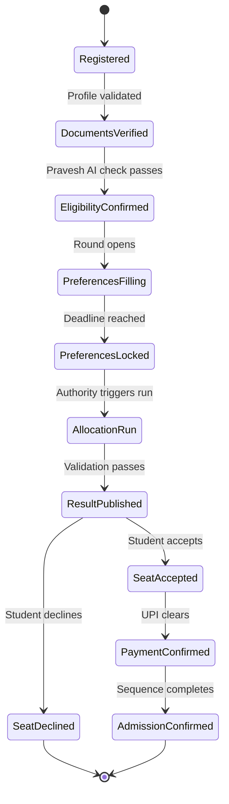
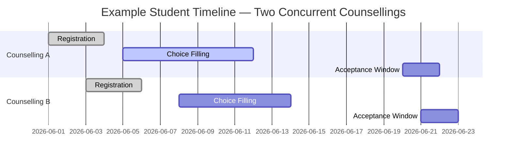

Superadmission coordinates two levels of the admission process. Within a single process, it manages steps such as registration, document submission, choice filling, allotment, acceptance, and reporting. Across the student’s overall activity, it maintains a unified view of deadlines, document status, application states, payments, verification status, and required actions.

These operate as separate coordination layers.

---

## Within a counselling

Every counselling on Superadmission follows a defined state machine. Each stage has a clear entry condition, a set of permitted actions, and a transition trigger.

No stage can be skipped or entered before its preconditions are met.

---

## Across the student's platform activity

A student on Superadmission may participate in multiple counselling processes simultaneously. The platform maintains a unified state across all active processes.

<CardGroup cols={2}>
  <Card title="Unified tracking" icon="calendar">
    All active processes are available in a single view. Alerts are generated based on the student’s current state in each process.
  </Card>

  <Card title="Proactive alerts" icon="bell">
    Notifications are triggered for upcoming deadlines, stage transitions, and required actions, based on the student’s status in each process.
  </Card>

  <Card title="Application state" icon="layer-group">
    Each application displays its current stage independently, within the same interface.
  </Card>

  <Card title="Document status" icon="file-check">
    A document verified once is reflected as verified across all active applications.
  </Card>
</CardGroup>

---

## Event triggers

Every state transition is event-driven.

| Event | Triggered by | Effect |
| --- | --- | --- |
| Profile validated | Pravesh AI | Unlocks application submission |
| Round opens | Authority action | Activates choice-filling interface |
| Deadline reached | System clock | Auto-locks preferences |
| Allocation run | Authority triggers | Runs module, validates, publishes |
| Payment confirmed | UPI callback | Triggers admission confirmation sequence |
| QR scanned | Institution device | Marks physical reporting complete |

---

## Deadline management

When windows overlap, the platform flags the conflict. The student sees both deadlines, their implications, and the timeline in one place.

  

    
  

  

    
  

---