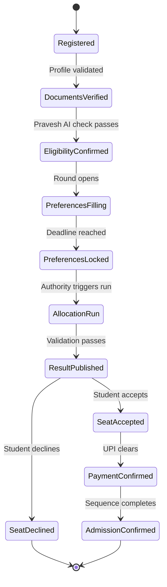
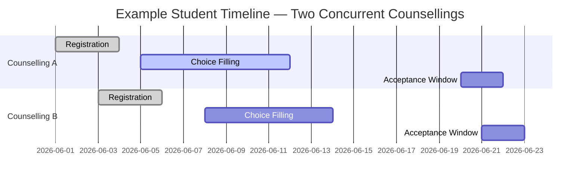

Superadmission coordinates two levels of the admission process. Within a single process, it manages steps such as registration, document submission, choice filling, allotment, acceptance, and reporting. Across the student’s overall activity, it maintains a unified view of deadlines, document status, application states, payments, verification status, and required actions.

These operate as separate coordination layers.

---

## Within a counselling

Every counselling on Superadmission follows a defined state machine. Each stage has a clear entry condition, a set of permitted actions, and a transition trigger.

No stage can be skipped. No stage can be entered before its preconditions are met.

---

## Across the student's platform activity

A student on Superadmission may participate in multiple counselling processes simultaneously. The platform maintains a unified state across all active processes.

<CardGroup cols={2}>
  <Card title="Unified tracking" icon="calendar">
    All active processes are available in a single view. Alerts are generated based on the student’s current state in each process.
  </Card>

  <Card title="Proactive alerts" icon="bell">
    Notifications are triggered for upcoming deadlines, stage transitions, and required actions, based on the student’s status in each process.
  </Card>

  <Card title="Application state" icon="layer-group">
    Each application displays its current stage independently, within the same interface.
  </Card>

  <Card title="Document status" icon="file-check">
    A document verified once is reflected as verified across all active applications.
  </Card>
</CardGroup>

<Tip>
  **Key distinction.** Superadmission does not coordinate between counselling authorities. Each authority runs its process independently. What the platform coordinates is the student's view and their document and deadline state across what they are participating in.
</Tip>

---

## Event triggers

Every state transition is event-driven. No polling. No manual checks.

| Event | Triggered by | Effect |
| --- | --- | --- |
| Profile validated | Pravesh AI | Unlocks application submission |
| Round opens | Authority action | Activates choice-filling interface |
| Deadline reached | System clock | Auto-locks preferences |
| Allocation run | Authority triggers | Runs module, validates, publishes |
| Payment confirmed | UPI callback | Triggers admission confirmation sequence |
| QR scanned | Institution device | Marks physical reporting complete |

---

## Deadline management

When windows overlap, the platform flags the conflict. The student sees both deadlines, their implications, and the timeline in one place.

<Frame caption="Deadline detail — due date, countdown, and one-tap Google Calendar sync for any counselling event">
  
</Frame>

<CardGroup cols={2}>
  <Card>
    
  </Card>

  <Card>
    
  </Card>
</CardGroup>

<Warning>
  Superadmission does not intervene between counselling authorities. It does not share a student's allocation status in one counselling with another authority. Each authority's process remains independent. The coordination layer exists for the student's view and workflow state not for cross-authority data sharing.
</Warning>

---

<Info>
  How human oversight and override mechanisms work within this coordination layer is in Safeguards and Oversight.
</Info>