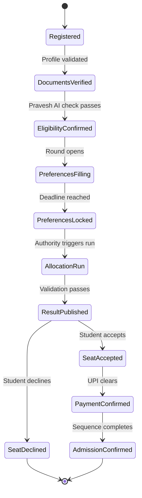
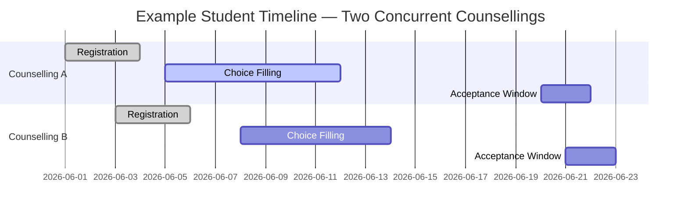

Superadmission coordinates two distinct things. Within a single counselling process, it orchestrates every step from registration to confirmation. Across the student's platform activity, it keeps deadlines, document status, and application states unified in one place.

These are separate coordination layers. Both matter.

---

## Within a counselling

Every counselling on Superadmission follows a defined state machine. Each stage has a clear entry condition, a set of permitted actions, and a transition trigger.

No stage can be skipped. No stage can be entered before its preconditions are met.

---

## Across the student's platform activity

A student on Superadmission may be active in more than one counselling simultaneously. The platform tracks their state across all of them unified alerts view, unified document status, unified application status.

<CardGroup cols={2}>
  <Card title="Unified deadline tracking" icon="calendar">
    Every deadline from every active counselling in one view. Alerts fire per counselling, specific to the student's actual registration state.
  </Card>

  <Card title="Document status" icon="file-check">
    A document verified once is reflected as verified across all active applications. No per-counselling document re-check required.
  </Card>

  <Card title="Application state" icon="layer-group">
    Each counselling's application shows its current stage independently within the same platform.
  </Card>

  <Card title="Proactive alerts" icon="bell">
    Deadline approaching. Round opening. Action required. Notifications are specific.
  </Card>
</CardGroup>

<Tip>
  **Key distinction.** Superadmission does not coordinate between counselling authorities. Each authority runs its process independently. What the platform coordinates is the student's view and their document and deadline state across what they are participating in.
</Tip>

---

## Event triggers

Every state transition is event-driven. No polling. No manual checks.

| Event | Triggered by | Effect |
| --- | --- | --- |
| Profile validated | Pravesh AI | Unlocks application submission |
| Round opens | Authority action | Activates choice-filling interface |
| Deadline reached | System clock | Auto-locks preferences |
| Allocation run | Authority triggers | Runs engine, validates, publishes |
| Payment confirmed | UPI callback | Triggers admission confirmation sequence |
| QR scanned | Institution device | Marks physical reporting complete |

---

## Deadline management

When windows overlap, the platform flags the conflict. The student sees both deadlines, their implications, and the timeline in one place. The decision is theirs.

---

## What coordination does not include

<Warning>
  Superadmission does not intervene between counselling authorities. It does not share a student's allocation status in one counselling with another authority. Each authority's process remains independent. The coordination layer exists for the student's view and workflow state not for cross-authority data sharing.
</Warning>

---

<Info>
  How human oversight and override mechanisms work within this coordination layer is in Safeguards and Oversight.
</Info>