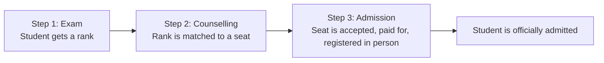
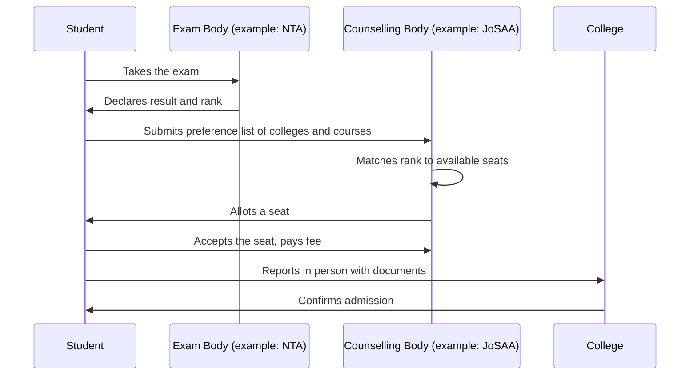
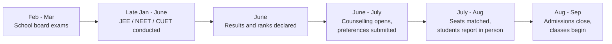

lets take an example...

There is a student of class XIIth, Unnati from Delhi. Much like any other student after much deliberation she decided to opt for Science [Non-Medical] stream post her Xth boards. Now she's standing at this crucial stage where she must learn how to navigate the upcoming journey from school to college. 

She can't apply directly to a college/uni and get admission. Instead She must do three separate things in the following order:

1. Apply and then appear in a competitive exam <Tooltip tip="As she opted from science stream">(likely JEE Mains/Adv)</Tooltip>
2. After about a month when results are announced, she will participate in something called counselling.
3. Only after counselling is complete, she will secure admission in a college. 

## Step 1: The Competitive Exam 

Unnati sits for one or more competitive exams based on <Tooltip tip="In India, students can attempt multiple competitive exams without any restrictions on the total number. Some of these exams, like NEET and JEE, are based strictly on specific academic streams. Others, such as CUET, focus on common subjects chosen by the candidate. However, each exam maintains its own specific eligibility criteria that students must meet to qualify.">her stream and career goals</Tooltip>, gets a score, and based on that <Tooltip tip="Score is the total number of marks you earn based on your correct and incorrect answers (e.g., scoring 620 out of 720 in NEET).">score</Tooltip> she is given a 'rank'.

A rank is not the same as score. Scores are the raw marks and rank is a position: <u>"She scored higher than X no. of students, and lower than Y students."</u> You'll see going forward, rank is what actually matter.

Different exams exist for different fields:

- To apply for engineering seats in the IITs, NITs, and a few other institutes, a student takes an exam called <Tooltip tip="Joint Entrance Examination, a two-tiered process comprising the national screening round JEE Main and the advanced tier for top-rankers. ">JEE</Tooltip>.
- To apply for any medical seat (MBBS, BDS) anywhere in India, a student takes an exam called <Tooltip tip="National Eligibility cum Entrance Test: A single-tier national medical entrance test where students answer questions across Physics, Chemistry, and Biology.">NEET</Tooltip>.
- To apply for a general degree (arts, commerce, science) at a central university, a student takes an exam called <Tooltip tip="Common University Entrance Test: A flexible, multi-subject national exam that lets students choose specific domain subjects, general tests, and languages.">CUET</Tooltip>.

India conducts over <Tooltip tip="These 150+ academic entrance exams comprise roughly 50 national-level filters (like JEE, NEET, and CUET), over 30 state-specific engineering and medical CETs, and more than 70 independent tests conducted by top private universities and specialized design, law, or management institutes.">150</Tooltip> national and state-level competitive exams, giving students the flexibility to choose their ideal career path based on their stream, interests, and eligibility criteria.

A govt. organisation, called NTA (National Testing Agency), conducts most of these exams. NTA's only job is to conduct the exam and declare the result and the rank. NTA does not run any college, and has no role in which college a student ends up in. 

## Step 2: Counselling

Counselling, in this context, has nothing to do with therapy or emotional support. This is a term for a specific process used to match a student's rank to an actual admission in a college.

Here is exactly what it involves. After the exam result is out, she will have to<Tooltip tip="Add tooltip text"> register</Tooltip>on a specific website and list out colleges and courses in order of preference, from most wanted to least wanted. Once every     student has submitted their list, a computer program looks at everyone's rank, looks at how many seats each college has, and matches each student to one seat, if a match is possible.

That entire process, from submitting the preference list to being told "this is your college," is what counselling means.

### Counselling is not run by one single organisation (currently)

Here comes the most confusing part. There is no single authority that runs counselling for the whole country. Different organisations/agencies run counselling for different sets of colleges/courses:

- Admissions in IITs, NITs, and a few other centrally funded institutes are matched/alloted by an organisation called <Tooltip tip="Add tooltip text">JoSAA</Tooltip>.
- Medical seats (MBBS, BDS) across most of the country are matched by an organisation called <Tooltip tip="Add tooltip text">MCC</Tooltip>.
- Seats specifically reserved for students belonging to a particular state are matched by that <Tooltip tip="Add tooltip text">state's own counselling authority(s)</Tooltip>, separate from both JoSAA and MCC.

A student, depending on the course they want and the state they belong to, may have to repeat this same preference-listing process on two or three different websites, run by different organisations, each with its own registration-process and its own schedule/timelines.

There are, in fact, more than 40 such counselling bodies operating across India, each one responsible for its <Tooltip tip="Add tooltip text">own set of colleges</Tooltip>.

Understand more about counselling and preference listing process here.

## Step 3: Admission

Getting matched to a <Tooltip tip="Add tooltip text">college-course set</Tooltip> during counselling is not the same as being admitted. Two more things have to happen.

First, the student has to accept the seat and pay a fee to confirm the acceptance. Second, the student has to physically go to that college, in person, with the required documents, within a fixed number of days, and complete final registration there.

Only once that in-person registration is done, the student is officially admitted to that college. Skipping this step, or missing the deadline, means the seat is released and given to someone else.

India has more than 58,600 colleges and universities. Each one only receives students who are sent by whichever counselling organisation is responsible for it. A college has no direct way of admitting a student on its own, outside this process, for the seats covered by counselling.

## Putting the Three Steps Together

## How the Three Steps Look for One Student 

The above given figure depicts a outline of a students admission journey across only one competitive exam and one counselling body.

## When This Happens Across the Year

Exact dates change every year, but the order of events stays the same.

Board exams, entrance exams, and counselling overlap on this calendar. A student is often submitting counselling preferences for one exam while still preparing for another one. This is one of the main reasons this period feels rushed, the schedule does not allow one thing to be finished before the next one starts.
