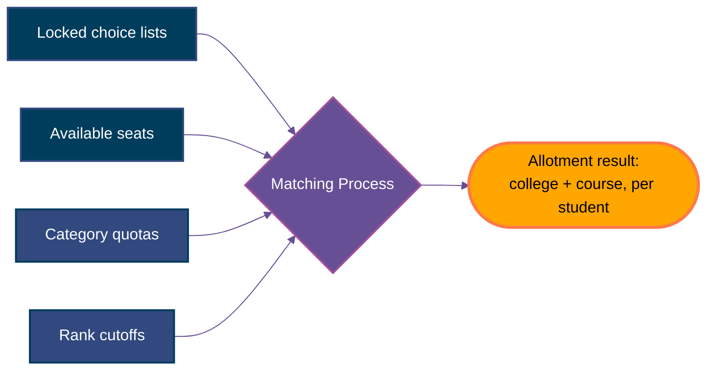
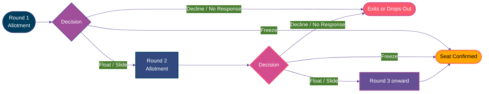
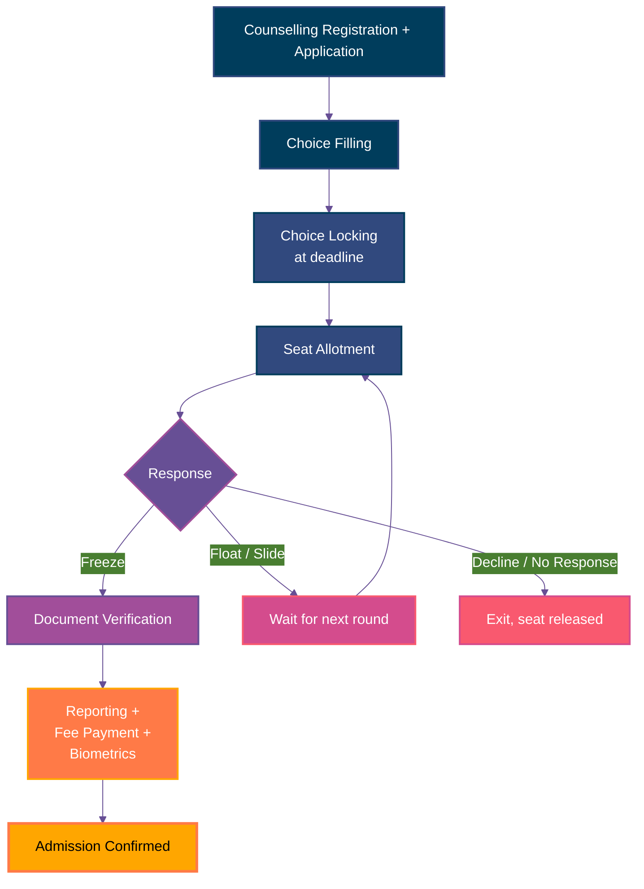

Continuing Unnati's journey as JEE Mains result is out and she has a rank now. To get into college via this rank she goes through counselling, and counselling has a lot more steps and complexities than most students expect going in.

## What Her Result Actually Contains

Before registration, it is important to understand what different parts of result says what because each of it gets used (or asked) at different places.

- **Overall rank/**<Tooltip tip="Add tooltip text">CRL</Tooltip>**:** Her position against every student who took the exam, regardless of category.
- **Category rank:** A separate ranking, calculated only among students of her <Tooltip tip="Add tooltip text">specific category</Tooltip>(such as OBC-NCL, SC, ST, EWS, or PwD), used whenever a set of seats is reserved for that category.
- **Subject percentile:** For some exams, a percentile specific to a subject combination (for example, a Physics-Chemistry-Maths percentile in JEE Main), used for eligibility on certain courses, <Tooltip tip="Add tooltip text">like</Tooltip>.

<Note>
  A student applying for a general-category seat mainly needs the overall rank. A student applying for a reserved-category seat needs the category rank instead<Tooltip tip="bifurcation between national-cateorgy rank and state - CRL">\*</Tooltip>, since that is what gets compared against the reserved cutoff and not the overall rank.
</Note>

#insert mock result image

## Creating Counselling Profile

Registration is not a separate account, It is one combined process and it works by <Tooltip tip="Add tooltip text">fetching the identity</Tooltip> student already has from the exam. 

<Steps>
  <Step title="Log In Using Exam Credentials">
    Unnati goes to the official JoSAA website (josaa.nic.in) and clicks "Candidate Registration." There is no email-and-password signup like a typical website. Instead, she logs in using her JEE Main application number  along with the same password she already set while registering for that exam.
  </Step>
  <Step title="Then, Portal Auto-Fetches Her Profile ">
    The moment she logs in, JoSAA pulls her data directly from the National Testing Agency's own records and fills in her profile on its own: her name, date of birth, gender, category, her All India Rank, and her state of eligibility. None of this is typed in by her, and none of it can be edited on this portal. If any of it is wrong, it has to be corrected at the exam body's end, not here.
  </Step>
  <Step title="Adding Fresh Information">
    A handful of details are not carried over from the exam.

    - **Contact re-verification:** an active mobile number and email, since every admission step requires OTPs and communication sent on these.
    - **Bank account details:** an account number, along with a cancelled cheque upload. This exists specifically so that if she withdraws admission later her <Tooltip tip="Acceptance fee for alloted seat paid after counselling round">deposit</Tooltip> has an account to be refunded into.
    - **A new password:** separate from her exam password, created just for this portal, used later to lock her list of college choices.

    **_Note for University Portals (like DU CSAS or IPU):_** Unlike JoSAA's quick login, these university portals require a more detailed Application Form Phase right here. Before moving forward, you must manually type in your personal and academic information like Class 10 & 12 subject-wise marks to verify eligibility, upload your scanned academic and category documents, and pay a separate counselling registration fee to lock the form.
  </Step>
  <Step title="Submit and Move Straight to Choice Filling">
    Once she submits this form, registration is complete. The portal takes her directly into choice filling.
  </Step>
</Steps>

## Step 2: Choice Filling

This is where Unnati tells the system what she actually wants. She is shown every college and course combination, and her job is to arrange as many of them as she wants, in order, from most preferred to least preferred. Each individual combination on this list is called a choice.

```mermaid
%%{init: {
  'theme': 'base',
  'themeVariables': {
    'primaryColor': '#31497e',
    'primaryTextColor': '#ffffff',
    'primaryBorderColor': '#003d5c',
    'lineColor': '#674f95',
    'background': 'transparent',
    'fontFamily': 'Inter, sans-serif'
  }
}}%%
flowchart LR
    A([Open choice filling portal]) --> B[Browse eligible<br/>college-course combinations]
    B --> C[Add preferred ones to the list]
    C --> D[Arrange in order of preference]
    D --> E{Satisfied?}
    E -- No --> C
    E -- Yes --> F[Lock the list before deadline]

    style A fill:#003d5c,stroke:#31497e,color:#ffffff,stroke-width:2px
    style B fill:#31497e,stroke:#003d5c,color:#ffffff,stroke-width:2px
    style C fill:#674f95,stroke:#a14e9a,color:#ffffff,stroke-width:2px
    style D fill:#a14e9a,stroke:#674f95,color:#ffffff,stroke-width:2px
    style E fill:#d44c8d,stroke:#f9596f,color:#ffffff,stroke-width:2px
    style F fill:#ffa600,stroke:#ff7a47,color:#000000,stroke-width:3px

```

A few things about this list that are easy to get wrong:

<AccordionGroup>
  <Accordion title="Order matters completely.">
    The <Tooltip tip="The allocation system uses a Deferred Acceptance algorithm, a smart computer program that processes students in order of rank, checking their choices from top to bottom and holding their best possible seat until everyone is placed.">allocation system</Tooltip> is linear and automated. It reads your list from top to bottom (1, 2, 3...) and will give you the very first college-course combination on your list that matches your rank. It will never look at choice #10 if you qualify for choice #5.
  </Accordion>

  <Accordion title="More choices generally help.">
    Leaving a college off your list does not protect you from getting it, nor does it make your top choices easier to get. It simply removes the possibility of getting it. If you don't fill enough choices, you risk ending up with no seat at all.
  </Accordion>

  <Accordion title="The list can be edited repeatedly until it's locked. ">
    Nothing is final the moment it is typed in. You can change the order, add new options, or delete choices as many times as you want during the open window.
  </Accordion>

  <Accordion title="Do not mix up the mock allotment with the actual one.">
    Many counselings run a "Mock Allotment" round. This is just a practice trial to show what seat you might get based on what students filled so far. It is not your final seat, and you must use this data to re-arrange your list before the locking deadline.
  </Accordion>

  <Accordion title="Never add a choice you hate just to fill space.">
    If the system awards you a seat that you explicitly listed, you cannot reject it to get a lower choice later. If you would rather sit out a year than go to a specific college, do not put it on your list.
  </Accordion>
</AccordionGroup>

---

## Step 3: Locking the Choices

Every round has a deadline for choice filling. Before that deadline, she can rearrange, add, or remove choices as many times as she wants. Once the deadline passes, the list locks automatically, exactly as it stands. Some portals also allow locking manually before the deadline, once a student is sure. 

## Step 4: Seat Allotment

Once every student locks their preferences, the counselling body runs its <Tooltip tip="The automated algorithm that scans your choices one by one from top to bottom, checking if your rank meets the cutoff for that specific seat before moving to the next candidate.">matching process</Tooltip> against all choices and seats to allot seats/admissions for the first <Tooltip tip="A round is a single stage of seat allocation where the computer runs its matching system once, publishes the results, and gives students a few days to secure their seat, this process typically repeats across 3 to 5 times/rounds to fill up all seats.">round</Tooltip> of counselling.

## Step 5: Responding to the Allotment

Every round comes with a short response window, and a student's decision at this stage falls into three broad categories.

<CardGroup cols={3}>
  <Card title="Accept" icon="check">
    Pay the seat acceptance fee, hold the seat, and choose how to participate going forward (see below).
  </Card>

  <Card title="Decline / Withdraw" icon="xmark">
    Exit counselling. The seat is then alloted to someone else in later rounds. Deposit (if any) refund rules vary by counselling body.
  </Card>

  <Card title="No Response" icon="clock">
    Missing the deadline without acting usually forfeits the allotment automatically. This is treated differently from a deliberate decline in some systems.
  </Card>
</CardGroup>

Within "Accept," JoSAA and many other counsellings breaks the choice down further:

<CardGroup cols={3}>
  <Card title="Freeze" icon="lock">
    Accept this seat and stop participating in further rounds. Right choice once you're genuinely satisfied with allotted seat.
  </Card>

  <Card title="Float" icon="arrows-up-down">
    Keep this seat for now, but stay in counselling for something higher on your list. A better seat may later replaces it automatically.
  </Card>

  <Card title="Slide" icon="shuffle">
    Stay at the same college, but stay open to a different course within it in a later round. The college itself is not at risk.
  </Card>
</CardGroup>

<Note>
  Exact terminology and rules differ across counselling bodies. MCC, state bodies, and university-specific systems phrase these options differently, and their refund rules for withdrawal are not identical. Freeze, float, and slide are the JoSAA version, useful as a mental model.
</Note>

## Step 6: Document Verification

This happens at two separate levels, even for the same student going through the same counselling process.

<Steps>
  <Step title="Authority-Level Verification">
    Unnati uploads her documents online. A verification team at the counselling body reviews them. If something is rejected, she usually gets one chance to resubmit. Some systems run this before the final round of allotment.
  </Step>
  <Step title="Institution-Level Verification">
    After her allotment is final, the institute verifies her original documents when she physically reports to college/uni. This happens again, even though the counselling authority already verified copies of the same documents. A mismatch at this stage can cancel the admission entirely.
  </Step>
</Steps>

## Step 7: Reporting and Fee Payment

To finalise admission, students must complete the final on-campus admission process:

- **Bring Original Documents:** Every document you uploaded online must be presented in original for physical verification at the college counter.
- **Pay the Balance Fee:** Pay the remaining college tuition fees. The seat acceptance fee you paid earlier to the counseling board will be deducted from this total.
- **Complete Biometrics:** The college office will record your fingerprints and photograph to secure your official student identity profile.
- **Collect Your Admission Slip:** Once the verification and payments clear, the college will print your official confirmation receipt. Your seat is now permanently yours.

## Rounds: Why This Repeats

Counselling never finishes in one round because students continuously change their minds or exit the process, previously claimed seats constantly become vacant again, requiring multiple rounds to ensure all remaining spots get filled.

<Accordion title="To visualise" icon="camera-movie">
  Think of counselling like a restaurant waiting list.

  Imagine a popular restaurant where a host manages a long line of hungry people based on who arrived first(their rank):

  - **Round 1:** The host calls out names and fills every table in the dining room.
  - **The Shifting:** Ten minutes later, a few families at the front change their minds and leave to eat somewhere else. A couple of other families get called but aren't at the door to answer, so they lose their spot.

  Suddenly, several premium tables are completely empty again. The host doesn't leave them empty instead they immediately call the next people in line to move forward and take those vacant spots.

  This constant moving up is exactly why counselling needs multiple rounds as people drop out or change their plans, people behind them gets a chance to step forward into a better seat.
</Accordion>

Most counselling bodies run somewhere between two and six such rounds. Every round repeats the exact same sequence.

## Spot Rounds

After all scheduled rounds are done there are almost always a few seats left empty across various colleges. A **Spot Round** is a fast-track allocation round conducted specifically to fill up these leftover seats. It works completely differently from a regular round in three major ways:

- **Lightning-Fast Announcements:** It is announced with very short notice sometimes giving you only a day or two to register and pay the spot round fee. You have to keep a constant eye on the website so you don't miss it.
- **Tight Decision Windows:** The time given to accept a seat, upload documents, or pay fees is heavily compressed. Instead of a week, you might only get a few hours to secure a seat before it passes to the next person.

Because cutoffs are usually much lower during this stage, the spot round is often a golden opportunity for lower-ranked students to secure a premium college that still has an empty seats.

## The Major Counselling Bodies

<CardGroup cols={2}>
  <Card title="JoSAA" icon="building-columns">
    Joint Seat Allocation Authority. Handles IITs, NITs, IIITs, and other centrally funded technical institutes (GFTIs), for JEE Main and JEE Advanced ranks.
  </Card>

  <Card title="CSAB" icon="building-columns">
    Central Seat Allocation Board. Runs special and leftover rounds for NITs, IIITs, and GFTIs after JoSAA's regular rounds finish. Also handles Home State quota seats within NITs.
  </Card>

  <Card title="MCC" icon="stethoscope">
    Medical Counselling Committee. Handles All India Quota (AIQ) seats for MBBS and BDS, plus AIIMS, JIPMER, and deemed medical universities, for NEET UG ranks.
  </Card>

  <Card title="AACCC" icon="leaf">
    AYUSH Admissions Central Counselling Committee. Handles All India Quota seats for Ayurveda, Homeopathy, Unani, and other AYUSH courses, also under NEET UG.
  </Card>

  <Card title="State Counselling Bodies" icon="map">
    A different body per state, such as KEA in Karnataka, MHT-CET CAP in Maharashtra, or the WBJEE Board in West Bengal. Handle state-quota seats in engineering, medical, and other professional courses.
  </Card>

  <Card title="University-Specific Cells" icon="school">
    Run individually by private and deemed universities that don't participate in any of the above, handling their own admission process end to end.
  </Card>
</CardGroup>

Every one of these bodies runs its own version of the same admission cycle described above. The steps stay identical. The website, the fee amount, the exact terminology, and the number of rounds are what change from one body to the next.

## The Full Cycle

This is the loop Unnati now goes through, once for JoSAA. A student targeting a medical seat runs through this same loop again on MCC's website. A student wanting a home-state engineering seat runs it a third time on their own state's portal.
